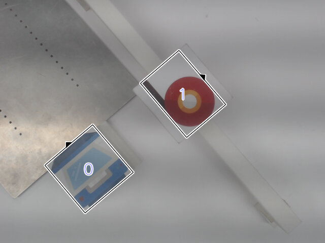

# YORO: A YOLO Variant for Rotated Object Detection

YORO, extended from YOLO feature map encoding, is a algorithm performimg
simultaneous realtime object detection and rotation detection.

The documentation project is here:
<https://github.com/jamesljlster/yoro-tutorial>  
But only Chinese version is available currently.  
If you want a English version, please open a issue for it.  
At least let me know you are interested in my project :D

The project is not stable yet.  
There are no guarantes for API compatibility.

## Requirement

See [requirements.txt][] for Python package
dependencies.  
The following dependencies need to pay attention:

-   PyTorch 1.8 and TorchVision 0.9

    Compatibilty with other versions is not guaranteed.

-   CUDA Toolkit & cuDNN

    If your PyTorch was built with CUDA support, please install the
    corresponding version of CUDA toolkit and cuDNN.

-   OpenCV 4.0.0+

    C++ development package is required.

## Collaboration Tools

-   [ICANMark][]: Annotation tool for rotated bounding box.

## Acknowledgement

Thanks ICAL Lab <http://www.ical.tw/> for providing a good workstation
for project development.

## Citation

If this project helps your work, please kindly cite it :)

    @unpublished{yoro,
        title={YORO: A YOLO Variant for Rotated Object Detection},
        author={Cheng-Ling Lai},
        note={Project URL: https://github.com/jamesljlster/yoro},
        year={2020}
    }

## Reference

-   <https://github.com/AlexeyAB/darknet>
-   <https://github.com/pjreddie/darknet>
-   <https://github.com/eriklindernoren/PyTorch-YOLOv3>
-   <https://github.com/WongKinYiu/ScaledYOLOv4>
-   <https://github.com/Zzh-tju/CIoU>

  [requirements.txt]: requirements.txt
  [ICANMark]: https://github.com/jamesljlster/ican_mark
